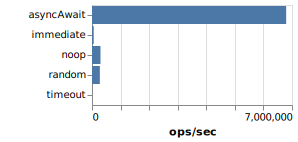
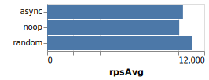
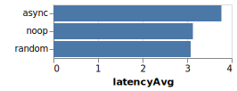
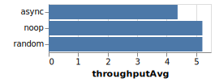

## @naturalcycles/bench-lib

> Benchmarking library, based on [Benchmark.js](https://github.com/bestiejs/benchmark.js/) and
> [Autocannon](https://github.com/mcollina/autocannon)

[](https://www.npmjs.com/package/@naturalcycles/bench-lib)
[](https://bundlephobia.com/result?p=@naturalcycles/bench-lib)
[](https://github.com/prettier/prettier)

# Why

Opinionated, high-level benchmarking library.

Allows to quickly benchmark your **functions** in a traditional benchmark.js or being served from a
bare Express.js http server.

See examples below!

# Show me the code 1 (benchmark.js)

```typescript
import { runBenchScript } from '@naturalcycles/bench-lib'

runBenchScript({
  fns: {
    noop: done => done.resolve(),
    random: done => {
      const _ = Math.random()
      done.resolve()
    },
    timeout: done => {
      setTimeout(() => done.resolve(), 0)
    },
    immediate: done => {
      setImmediate(() => done.resolve())
    },
    asyncAwait: async done => {
      await new Promise(resolve => resolve())
      done.resolve()
    },
  },
  runs: 2,
})
```

Will print:

```
noop x 241,077 ops/sec ±48.87% (31 runs sampled)
random x 280,523 ops/sec ±3.31% (33 runs sampled)
timeout x 768 ops/sec ±0.70% (79 runs sampled)
immediate x 59,573 ops/sec ±1.81% (76 runs sampled)
asyncAwait x 6,749,279 ops/sec ±0.99% (81 runs sampled)
Fastest is asyncAwait
```

Will produce [runBench.json](./demo/runBench.json) (numbers are ops/sec, or Hertz):

```json
{
  "noop": 239344,
  "random": 285384,
  "timeout": 775,
  "immediate": 60214,
  "asyncAwait": 6743787
}
```

Will produce [runBench.svg](./demo/runBench.svg) plot:



# Show me the code 2 (autocannon)

```typescript
import { runCannon, expressFunctionFactory } from '@naturalcycles/bench-lib'
import { _randomInt, pDelay } from '@naturalcycles/js-lib'

runCannon(
  {
    noop: expressFunctionFactory(() => 'yo'),
    async: expressFunctionFactory(async () => await pDelay(0, 'yo')),
    random: expressFunctionFactory(() => _randomInt(1, 10)),
  },
  {
    runs: 2,
    duration: 10,
  },
)
```

Will print:

```
┌─────────┬──────────┬─────────┬────────────┬───────────┬───────────┬───────────┬───────────────┬────────┬──────────┐
│ (index) │   name   │ rpsAvg  │ latencyAvg │ latency50 │ latency90 │ latency99 │ throughputAvg │ errors │ timeouts │
├─────────┼──────────┼─────────┼────────────┼───────────┼───────────┼───────────┼───────────────┼────────┼──────────┤
│    0    │  'noop'  │ 31603.2 │    3.13    │     0     │     1     │    33     │     5.21      │   0    │    0     │
│    1    │ 'async'  │ 26502.4 │    3.77    │     0     │    16     │    41     │     4.37      │   0    │    0     │
│    2    │ 'random' │  32092  │    3.08    │     0     │     0     │    33     │     5.21      │   0    │    0     │
└─────────┴──────────┴─────────┴────────────┴───────────┴───────────┴───────────┴───────────────┴────────┴──────────┘
```

Will produce [runCannon.summary.json](./demo/runCannon.json):

```json
[
  {
    "name": "noop",
    "rpsAvg": 31603.2,
    "latencyAvg": 3.13,
    "latency50": 0,
    "latency90": 1,
    "latency99": 33,
    "throughputAvg": 5.21,
    "errors": 0,
    "timeouts": 0
  },
  ...
]
```

Will produce plots:

 
 


# How

Fundamental difference between Benchmark.js and Autocannon is that the former is doing **serial**
execution (one-after-another), while latter is calling requests **concurrently** (with concurrency
as high as 100, by default). This results in "no-op async function" being executed ~700 times/second
sequentially (needing to do await the "tick" for each Promise), and ~32K times/second (requests per
second) while served from http server (concurrently).
